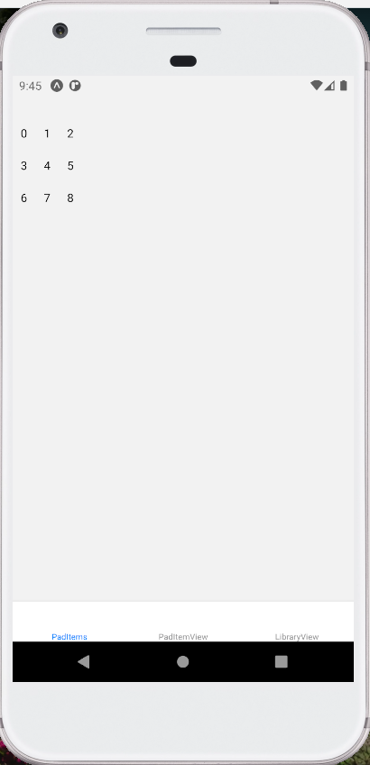

# Mystic tarot

### _Introduction_

The goal of this project is to implement a simplified virtual version of a physical sampler / sequencer. These systems allow the live play of a bank of pre-recorded sounds through the use of a grid of pads. In their simplest version, these machines can only be used in their sampler version: the samples are playable by pressing the pads, like a synthesizer, but more advanced versions allow the use of typesequencer (the user can create / edit a loop played repeatedly to create rhythms / patterns).

### _Application structure_
Application has 9 pads displayed as numbers in this case, clicking on each number(pad) a different sound will be played. 

On long press another view will open where: 

1. You can choose already saved sound from library 
2. Record a new audio and add it to the current pad and to the library  
3. Search for a new sound from "freesound api" and download it. When you click on one of the search results it will be downloaded and added to the pad automatically. 

There is also another view(LibraryView) where you can simply add new samples to the library.
### _Graphic interface_

